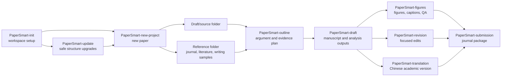

# PaperSmart Skills

[中文](README.zh.md)


PaperSmart is a reusable skill set for scientific manuscript projects. It is not a one-click paper generator. It is a practical workflow for keeping original materials, references, generated text, figures, revisions, translations, and submission files separate and traceable.

Use it when a paper has more than a single draft file: data tables, figures, journal rules, writing samples, reviewer comments, translation needs, or submission materials.

## Skills

| Skill | Use it when | Main output |
| --- | --- | --- |
| [`PaperSmart-init`](papersmart-init/SKILL.md) | You are setting up a workspace for the first time | Workspace folders, language profile, templates, and optional companion skills |
| [`PaperSmart-update`](papersmart-update/SKILL.md) | PaperSmart has changed and an existing workspace needs the current structure | Missing folders/templates, preserved files, migration notes, update report |
| [`PaperSmart-new-project`](papersmart-new-project/SKILL.md) | You are starting a new manuscript project | A new `paper_XX_slug` project folder |
| [`PaperSmart-outline`](papersmart-outline/SKILL.md) | You need the argument before drafting | Thesis, section plan, evidence plan, figure and table plan |
| [`PaperSmart-draft`](papersmart-draft/SKILL.md) | You need a full draft or major rewrite | Manuscript plus analysis, literature, visualization, and claim-source files |
| [`PaperSmart-revision`](papersmart-revision/SKILL.md) | A manuscript exists and needs focused edits | Revised text, synchronized citations, figure and table updates, change log |
| [`PaperSmart-AIREF`](papersmart-airef/SKILL.md) | A manuscript contains `*content*AIREF` markers | Verified citation support, narrowed claims when needed, and citation decision logs |
| [`PaperSmart-translation`](papersmart-translation/SKILL.md) | You need a Chinese academic version | `paper_zh.md` and translation notes |
| [`PaperSmart-figures`](papersmart-figures/SKILL.md) | You need figure planning, generation, captions, or QA | Figure files, captions, visualization plan |
| [`PaperSmart-submission`](papersmart-submission/SKILL.md) | You are preparing a journal package | Title page, anonymized manuscript, declarations, cover letter, checklist |

## Language Mode

`PaperSmart-init` asks which workspace language to use. English is the default. If Chinese is selected, the workspace uses Chinese folder names and Chinese template files.

Later PaperSmart skills read `papersmart_profile.md` and answer in the configured language.

| Mode | Profile path | Folder style | Assistant output |
| --- | --- | --- | --- |
| English | `shared/memory/papersmart_profile.md` | `projects/`, `shared/`, `01_draft/`, `02_reference/`, `03_output/` | English |
| Chinese | `共享/记忆/papersmart_profile.md` | `项目/`, `共享/`, `01_草稿/`, `02_参考/`, `03_输出/` | Chinese |

## Folder Structure

English mode:

```text
PaperSmart/
  projects/
    paper_01_short_slug/
      config/
        project_config.md
      logs/
        writing_log.md
        decision_log.md
      01_draft/
        README.md
        data_inventory.md
        data/
        figures/
        tables/
        notes/
      02_reference/
        README.md
        style_notes.md
        reference_index.md
        literature/
        target_journal/
        writing_samples/
      03_output/
        README.md
        manuscript/
        tables/
        figures/
        supplement/
        revision/
        translation/
        submission/
  shared/
    docs/
    prompts/
    tools/
    skills/
    memory/
```

Chinese mode:

```text
PaperSmart/
  项目/
    paper_01_short_slug/
      配置/
        项目配置.md
      日志/
        写作日志.md
        决策日志.md
      01_草稿/
        说明.md
        数据清单.md
        数据/
        图像/
        表格/
        笔记/
      02_参考/
        说明.md
        风格说明.md
        参考索引.md
        文献/
        目标期刊/
        写作样本/
      03_输出/
        说明.md
        正文/
        表格/
        图像/
        补充材料/
        修订/
        翻译/
        投稿/
  共享/
    文档/
    提示/
    工具/
    技能/
    记忆/
```

## Directory Rules

| Directory | Put here | Do not put here |
| --- | --- | --- |
| `01_draft/` or `01_草稿/` | Original drafts, data, images, tables, notes, author instructions | Final generated manuscript files |
| `02_reference/` or `02_参考/` | Journal files, literature, citation files, style notes, writing samples | Project outputs or revision logs |
| `02_reference/writing_samples/` or `02_参考/写作样本/` | Writing examples used for tone, structure, headings, and pacing | Evidence sources unless the manuscript explicitly discusses their claims |
| `03_output/` or `03_输出/` | Manuscripts, tables, figures, supplements, translations, submission packages | Untracked source material |
| `config/` or `配置/` | Project metadata, journal profile, missing declarations | Manuscript body |
| `logs/` or `日志/` | Writing and decision logs | Data files or submission packages |
| `shared/` or `共享/` | Reusable documentation, prompts, tools, skills, memory | Single-paper project materials |

## Updating Existing Workspaces

Use `PaperSmart-update` after pulling a newer PaperSmart release. It upgrades the folder contract without damaging existing work.

```text
Use $papersmart-update to safely update this PaperSmart workspace.
```

The updater creates missing folders and missing template files. It preserves existing project files, source materials, outputs, memory, shared resources, revision records, and submission packages. Start with a dry run when you want to inspect the planned changes first.

```bash
python shared/skills/papersmart-update/scripts/update_papersmart.py --workspace . --dry-run
```

## Workflow



## Install

PaperSmart can be installed in two ways.

Use **plugin installation** if you want slash commands such as `/papersmart-draft`. Use **skills-only installation** if your assistant only supports direct skill folders.

### Plugin Installation For Slash Commands

Install this repository as a local plugin. The plugin manifest is:

```text
.codex-plugin/plugin.json
```

After plugin installation and restart, these slash commands are available:

| Slash command | Routes to |
| --- | --- |
| `/papersmart` | Selects the right PaperSmart workflow |
| `/papersmart-init` | `PaperSmart-init` |
| `/papersmart-update` | `PaperSmart-update` |
| `/papersmart-new-project` | `PaperSmart-new-project` |
| `/papersmart-outline` | `PaperSmart-outline` |
| `/papersmart-draft` | `PaperSmart-draft` |
| `/papersmart-revision` | `PaperSmart-revision` |
| `/papersmart-airef` | `PaperSmart-AIREF` |
| `/papersmart-translation` | `PaperSmart-translation` |
| `/papersmart-figures` | `PaperSmart-figures` |
| `/papersmart-submission` | `PaperSmart-submission` |

### Skills-Only Installation

Copy the `papersmart-*` folders into your assistant's local skills directory, then restart that environment.

```text
<skills-dir>/
  papersmart-init/
  papersmart-update/
  papersmart-new-project/
  papersmart-outline/
  papersmart-draft/
  papersmart-revision/
  papersmart-airef/
  papersmart-translation/
  papersmart-figures/
  papersmart-submission/
```

PowerShell:

```powershell
$dest = "<skills-dir>"
New-Item -ItemType Directory -Force -Path $dest | Out-Null
Copy-Item -Recurse -Force .\papersmart-* $dest
```

Bash:

```bash
mkdir -p "<skills-dir>"
cp -R papersmart-* "<skills-dir>/"
```

## Quick Start

With slash commands:

```text
/papersmart-init
```

```text
/papersmart-draft
```

With direct skill calls:

```text
Use $papersmart-init to initialize a PaperSmart workspace.
```

```text
Use $papersmart-update to safely update an existing PaperSmart workspace after pulling a newer release.
```

```text
Use $papersmart-new-project to create a new project for my paper on AI and architectural education.
```

```text
Use $papersmart-outline to create an evidence-grounded outline for the active PaperSmart project.
```

```text
Use $papersmart-draft to generate a full manuscript from the active PaperSmart project materials.
```

```text
Use $papersmart-airef to resolve AIREF-marked claims with verified citations.
```

## Writing Boundaries

PaperSmart keeps these boundaries strict:

- Do not invent data, results, citations, author details, ethics statements, funding, conflicts of interest, or acknowledgements.
- Do not put chat replies, user comments, screenshot provenance, or drafting plans into manuscript prose.
- Mark missing information with `TODO: [specific missing evidence or action]`.
- Do not explain open evidence gaps inside manuscript prose. Keep the article voice formal; put evidence decisions in revision notes, supplement files, or logs.
- Keep original materials in the draft and reference folders.
- Write generated outputs to the output folder.
- Analyze before writing Results. Do not just restate table contents.
- Give every table and figure a stable file name, title, caption, source note, and in-text citation.
- Keep major claims traceable to source materials, data, figures, tables, literature, or explicit author instructions.

## AIGEN, AIPO, And AIREF

PaperSmart supports inline editing markers in draft and revision workflows:

- `*content*AIGEN` means regenerate the marked span as substantive manuscript prose from the surrounding context and verified evidence.
- `*content*AIPO` means polish the marked span while preserving its meaning.
- `*content*AIREF` means verify the marked claim, find suitable scholarly or authoritative support, add citation markers, and narrow the claim when the evidence requires it.

Resolve these markers before final manuscript handoff unless the user explicitly requests a marked review copy. These markers are workflow instructions, not evidence by themselves. If the evidence is missing, use `TODO: [specific missing evidence or action]` instead.

If a journal, institution, or publisher requires AI-use disclosure, summarize AI assistance in a formal declaration or cover material. Do not leave scattered `AIGEN` or `AIPO` labels in the article body.

## Public Sync Privacy

Before publishing PaperSmart skill updates to GitHub, scrub the content for personal names, scholar names, local paths, private project titles, unpublished manuscript details, memory excerpts, institutional documents, client/user identifiers, and project-specific evidence. Public skill docs should contain generic workflow guidance only.

## License

Help you help me
