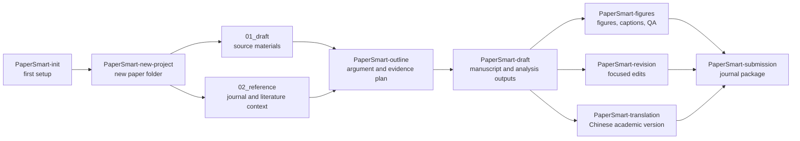

# PaperSmart Skills


PaperSmart 是一组面向科研写作和论文项目管理的 Codex skills。它不是“自动写完一篇论文”的按钮，更像一套可靠的工作规矩：先把材料放对位置，再把证据、数据、文献、图表、修稿和投稿拆成可以追踪的步骤。

这套 skills 适合研究者、实验室、编辑和写作协作者使用。尤其适合那些材料很多、版本很多、图表和文献都不能乱来的论文项目。

## 这套 skills 做什么

PaperSmart 把一篇论文拆成八个常见动作。每个动作都有自己的 skill，避免所有事情都塞进一个笨重的“大写作助手”里。

| Skill | 什么时候用 | 主要输出 |
| --- | --- | --- |
| [`PaperSmart-init`](papersmart-init/SKILL.md) | 第一次搭建 PaperSmart 工作区 | `projects/`、`shared/`、基础模板和必要 companion skills |
| [`PaperSmart-new-project`](papersmart-new-project/SKILL.md) | 每次开始一篇新论文 | 新的 `projects/paper_XX_slug/` 项目目录 |
| [`PaperSmart-outline`](papersmart-outline/SKILL.md) | 写正文前搭论文结构 | 论点、章节安排、证据计划、图表计划 |
| [`PaperSmart-draft`](papersmart-draft/SKILL.md) | 生成完整初稿或做大幅重写 | `03_output/manuscript/paper.md` 及配套分析文件 |
| [`PaperSmart-revision`](papersmart-revision/SKILL.md) | 已有正文后的局部修稿 | 修改后的正文、同步后的图表/引用、change log |
| [`PaperSmart-translation`](papersmart-translation/SKILL.md) | 需要中文学术版本 | `03_output/translation/paper_zh.md` 和翻译说明 |
| [`PaperSmart-figures`](papersmart-figures/SKILL.md) | 规划、生成或检查论文图表 | `03_output/figures/`、visualization plan、caption notes |
| [`PaperSmart-submission`](papersmart-submission/SKILL.md) | 准备投稿材料 | title page、匿名稿、声明、cover letter、submission checklist |

## 工作区结构

PaperSmart 的核心是一个很简单的边界：每篇论文一个项目，跨项目资源放在共享区。

```text
PaperSmart/
  projects/
    paper_01_short_slug/
      config/
        project_config.md
      01_draft/
        README.md
        data_inventory.md
        data/
        figures/
        tables/
        notes/
      02_reference/
        style_notes.md
        reference_index.md
        literature/
        target_journal/
      03_output/
        manuscript/
        tables/
        figures/
        supplement/
        revision/
        translation/
        submission/
      logs/
        writing_log.md
        decision_log.md
  shared/
    docs/
    prompts/
    tools/
    skills/
    memory/
```

目录含义：

| 目录 | 放什么 | 不放什么 |
| --- | --- | --- |
| `01_draft/` | 用户原始材料、草稿、数据、图片、表格、笔记 | Codex 生成的最终稿 |
| `02_reference/` | 目标期刊格式、写作样例、文献、引用文件 | 项目输出和修稿记录 |
| `03_output/` | 论文正文、表格、图、补充材料、翻译、投稿包 | 未备份的原始材料 |
| `config/` | 项目配置、目标期刊、作者和声明待确认项 | 论文正文 |
| `logs/` | 写作过程和重要决定 | 数据或投稿包 |
| `shared/` | 跨项目文档、prompts、工具、skills、长期记忆 | 单篇论文的专用材料 |

## PaperSmart 流程图



## 安装

把本仓库中的 `papersmart-*` 文件夹复制到 Codex skills 目录，然后重启 Codex。

Windows PowerShell:

```powershell
$dest = "$env:USERPROFILE\.codex\skills"
New-Item -ItemType Directory -Force -Path $dest | Out-Null
Copy-Item -Recurse -Force .\papersmart-* $dest
```

macOS or Linux:

```bash
mkdir -p ~/.codex/skills
cp -R papersmart-* ~/.codex/skills/
```

如果你把整个 PaperSmart 工作区发布到 GitHub，而不是只发布 `shared/skills`，请从 `shared/skills` 目录里复制这些 `papersmart-*` 文件夹。

## 推荐配套 skills

`PaperSmart-init` 可以帮助安装或提示安装这些配套 skills：

| Companion skill | 用途 |
| --- | --- |
| `find-skills` | 在复杂任务里选择最少、最合适的 skills |
| `humanizer` | 需要去掉明显 AI 腔时使用 |
| `nature-academic-search` | 文献检索、证据整理、引用核查 |
| `nature-writing` / `nature-polishing` | Nature 风格的学术写作和润色 |
| `nature-figure` | 高质量科学图表生成与检查 |
| `nature-citation` | 为主张补充可追踪引用 |

这些配套 skills 不是所有任务都必须用。PaperSmart 的原则是少用，但用对。

## 快速开始

第一次搭建工作区：

```text
Use $papersmart-init to initialize a PaperSmart workspace.
```

开始一篇新论文：

```text
Use $papersmart-new-project to create a new project for my paper on AI and architectural education.
```

材料放好后生成提纲：

```text
Use $papersmart-outline to create an evidence-grounded outline for the active PaperSmart project.
```

生成完整初稿：

```text
Use $papersmart-draft to generate a full manuscript from the active PaperSmart project materials.
```

局部修稿：

```text
Use $papersmart-revision to apply the tasks in 03_output/revision/local_revision_tasks.md.
```

## 写作边界

PaperSmart 的底线很硬：

- 不编造数据、结果、引用、作者信息、伦理、基金、利益冲突或致谢。
- 缺失信息写成精确的 `TODO:`，不要用漂亮话糊过去。
- 原始材料留在 `01_draft` 和 `02_reference`，生成物写入 `03_output`。
- Results 先分析再写，不把表格内容机械复述一遍。
- 每张图和每张表都要有稳定文件名、标题、caption、来源和正文引用。
- 重要主张要能追到用户材料、数据、图表、文献或明确的作者指示。

## 发布建议

如果你准备把这些 skills 单独发布成一个 GitHub 仓库，建议仓库根目录保持这样：

```text
papersmart-skills/
  README.md
  assets/
    papersmart-hero.png
  papersmart-init/
  papersmart-new-project/
  papersmart-outline/
  papersmart-draft/
  papersmart-revision/
  papersmart-translation/
  papersmart-figures/
  papersmart-submission/
```

如果你准备发布完整 PaperSmart 工作区，可以保留当前结构，把这一份 README 作为 `shared/skills/README.md`。需要让用户知道：真正可安装的是 `shared/skills/papersmart-*` 这些文件夹。

## License

TODO: add a license before public release.
