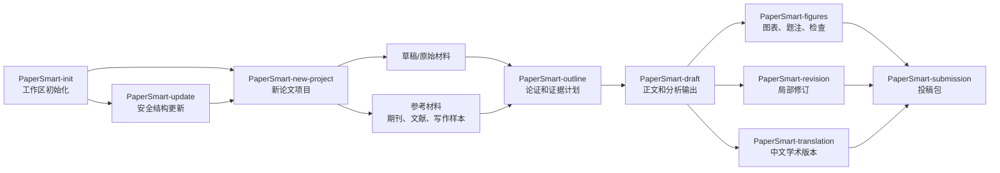

# PaperSmart 技能

[English](README.md)


PaperSmart 是一组用于科研论文项目的可复用技能。它不是“一键写论文”的工具，而是一套可执行的工作流程：原始材料、参考资料、生成稿、图表、修订、翻译和投稿文件各放其位，后续修改可以追踪。

当一个论文项目不再只是一个文档时，PaperSmart 会更有用：它适合管理数据表、图像、期刊规则、写作样本、审稿意见、中文翻译和投稿材料。

## 技能列表

| 技能 | 什么时候用 | 主要输出 |
| --- | --- | --- |
| [`PaperSmart-init`](papersmart-init/SKILL.md) | 第一次搭建工作区 | 工作区目录、语言配置、模板、可选配套技能 |
| [`PaperSmart-update`](papersmart-update/SKILL.md) | PaperSmart 升级后，需要更新既有工作区结构 | 缺失目录和模板、保留记录、迁移说明、更新报告 |
| [`PaperSmart-new-project`](papersmart-new-project/SKILL.md) | 开始新的论文项目 | 新的 `paper_XX_slug` 项目文件夹 |
| [`PaperSmart-outline`](papersmart-outline/SKILL.md) | 正式起草前梳理论证 | 核心论点、章节计划、证据计划、图表计划 |
| [`PaperSmart-draft`](papersmart-draft/SKILL.md) | 生成全文初稿或大幅重写 | 正文，以及分析、文献、可视化、主张来源文件 |
| [`PaperSmart-revision`](papersmart-revision/SKILL.md) | 已有正文后做局部修改 | 修订后的文字、同步后的引用和图表、修改记录 |
| [`PaperSmart-translation`](papersmart-translation/SKILL.md) | 需要中文学术版本 | `paper_zh.md` 和翻译说明 |
| [`PaperSmart-figures`](papersmart-figures/SKILL.md) | 规划、生成或检查论文图表 | 图表文件、题注、可视化计划 |
| [`PaperSmart-submission`](papersmart-submission/SKILL.md) | 准备期刊投稿包 | 标题页、匿名稿、声明、投稿信、检查清单 |

## 语言模式

`PaperSmart-init` 会先询问工作区语言。默认使用英文。选择中文后，工作区会使用中文文件夹名和中文模板文件。

后续 PaperSmart 技能会读取 `papersmart_profile.md`，并按配置语言输出。

| 模式 | 配置文件位置 | 文件夹命名 | 输出语言 |
| --- | --- | --- | --- |
| 英文 | `shared/memory/papersmart_profile.md` | `projects/`、`shared/`、`01_draft/`、`02_reference/`、`03_output/` | 英文 |
| 中文 | `共享/记忆/papersmart_profile.md` | `项目/`、`共享/`、`01_草稿/`、`02_参考/`、`03_输出/` | 中文 |

## 文件结构

英文模式：

```text
PaperSmart/
  projects/
    paper_01_short_slug/
      config/
        project_config.md
      logs/
        writing_log.md
        decision_log.md
      01_draft/
        README.md
        data_inventory.md
        data/
        figures/
        tables/
        notes/
      02_reference/
        README.md
        style_notes.md
        reference_index.md
        literature/
        target_journal/
        writing_samples/
      03_output/
        README.md
        manuscript/
        tables/
        figures/
        supplement/
        revision/
        translation/
        submission/
  shared/
    docs/
    prompts/
    tools/
    skills/
    memory/
```

中文模式：

```text
PaperSmart/
  项目/
    paper_01_short_slug/
      配置/
        项目配置.md
      日志/
        写作日志.md
        决策日志.md
      01_草稿/
        说明.md
        数据清单.md
        数据/
        图像/
        表格/
        笔记/
      02_参考/
        说明.md
        风格说明.md
        参考索引.md
        文献/
        目标期刊/
        写作样本/
      03_输出/
        说明.md
        正文/
        表格/
        图像/
        补充材料/
        修订/
        翻译/
        投稿/
  共享/
    文档/
    提示/
    工具/
    技能/
    记忆/
```

## 目录规则

| 目录 | 放什么 | 不放什么 |
| --- | --- | --- |
| `01_draft/` 或 `01_草稿/` | 原始草稿、数据、图片、表格、笔记、作者指示 | 最终生成稿 |
| `02_reference/` 或 `02_参考/` | 期刊文件、文献、引用文件、风格说明、写作样本 | 项目输出或修订日志 |
| `02_reference/writing_samples/` 或 `02_参考/写作样本/` | 用于学习语气、结构、标题和段落节奏的写作样本 | 证据材料，除非正文明确讨论其观点 |
| `03_output/` 或 `03_输出/` | 正文、表格、图像、补充材料、翻译稿、投稿包 | 未追踪来源的原始材料 |
| `config/` 或 `配置/` | 项目元数据、期刊信息、待确认声明 | 正文 |
| `logs/` 或 `日志/` | 写作过程和重要决策 | 数据文件或投稿包 |
| `shared/` 或 `共享/` | 跨项目文档、提示、工具、技能、记忆 | 单篇论文材料 |

## 更新既有工作区

拉取新版 PaperSmart 后，使用 `PaperSmart-update` 更新既有工作区。它只补齐当前版本需要的目录和模板，不破坏已有项目文件。

```text
使用 $papersmart-update 安全更新当前 PaperSmart 工作区。
```

更新脚本会创建缺失的文件夹和缺失模板，并保留已有项目文件、原始材料、输出、memory、shared 资源、修订记录和投稿包。需要先检查计划时，先运行 dry run。

```bash
python shared/skills/papersmart-update/scripts/update_papersmart.py --workspace . --dry-run
```

## 工作流程



## 安装

将 `papersmart-*` 文件夹复制到你的助手技能目录，然后重启对应环境。

```text
<skills-dir>/
  papersmart-init/
  papersmart-update/
  papersmart-new-project/
  papersmart-outline/
  papersmart-draft/
  papersmart-revision/
  papersmart-translation/
  papersmart-figures/
  papersmart-submission/
```

PowerShell：

```powershell
$dest = "<skills-dir>"
New-Item -ItemType Directory -Force -Path $dest | Out-Null
Copy-Item -Recurse -Force .\papersmart-* $dest
```

Bash：

```bash
mkdir -p "<skills-dir>"
cp -R papersmart-* "<skills-dir>/"
```

## 快速开始

```text
使用 $papersmart-init 初始化 PaperSmart 工作区。
```

```text
使用 $papersmart-update 在拉取新版后安全更新既有 PaperSmart 工作区。
```

```text
使用 $papersmart-new-project 为我关于 AI 与建筑教育的论文创建新项目。
```

```text
使用 $papersmart-outline 为当前 PaperSmart 项目生成基于证据的提纲。
```

```text
使用 $papersmart-draft 根据当前 PaperSmart 项目材料生成完整论文初稿。
```

## 写作边界

PaperSmart 的底线明确：

- 不编造数据、结果、引用、作者信息、伦理声明、基金、利益冲突或致谢。
- 不把聊天回复、用户评论、截图来源说明或写作计划写进论文正文。
- 缺失信息写成精确的 `TODO:`。
- 原始材料留在草稿和参考目录。
- 生成物写入输出目录。
- Results 先分析再写，不机械复述表格内容。
- 每张图和每张表都要有稳定文件名、标题、题注、来源说明和正文引用。
- 重要主张必须能追溯到原始材料、数据、图表、文献或明确的作者指示。

## 许可证

专心研究和生活，论文这种杂活就交给AI吧
